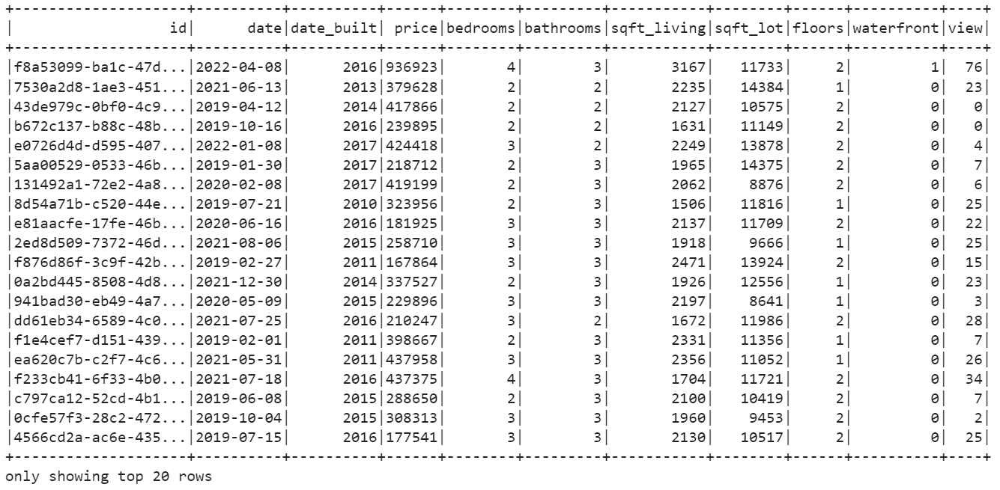

# Home_Sales
 This project demonstrated the usage of SparkSQL to read, query, cache, and analyze home sales data, providing insights into average prices based on various criteria.

### Home Sales SparkSQL

The Home Sales project focuses on leveraging the power of SparkSQL to answer specific questions related to home sales data. The analysis includes creating temporary views, partitioning data, caching, and exploring Parquet data storage.

### 1 Introduction 

The project encompasses tasks such as creating temporary views, partitioning data, caching and uncaching tables, and executing queries to extract key metrics. The analysis includes determining the average prices of homes based on different criteria, such as the number of bedrooms, bathrooms, and the year of construction. Additionally, the project involves optimizing queries through caching and exploring the impact on runtime.

Furthermore, the project delves into the use of parquet file format, partitioning data based on the "date_built" field, and comparing the runtime of queries on parquet-formatted data versus the original dataset. 

### 2 Dependencis

Following dependencies has been installed:

Python (version 3.9 or later)

PySpark

SparkSQL

Jupyter Notebook

Apache Spark (for local development or cluster setup)

### 3 How the Home Sales PySpark DataFrame Shown

### 4 How the Whole Data Analysis Works 

The following steps were taken to perform the analysis:

- **Importing Packages**: The project started by importing the necessary packages, including findspark to initialize Spark and pyspark.sql for working with SparkSQL.

- **Creating a SparkSession**: A SparkSession was created using `SparkSession.builder.appName("SparkSQL").getOrCreate()` to establish a connection to Spark.

- **Reading Data**: The home sales data was read from an AWS S3 bucket into a DataFrame using the provided URL.

- **Creating a Temporary View**: A temporary view named "my_table" was created for the DataFrame using `createOrReplaceTempView()` method. This allowed for running SQL queries on the DataFrame.

- **Querying the Data**: Several SQL queries were executed to analyze the home sales data. This included calculating the average price for a four-bedroom house sold in each year and the average price of homes based on different criteria such as bedrooms, bathrooms, and square footage.

- **Caching the Data**: The temporary table "home_sales_df" was cached using `spark.catalog.cacheTable()` method to improve query performance by storing the data in memory.

- **Query Runtime Comparison**: The runtime of a specific query was compared between the cached version and the version using Parquet data. The start time was recorded using `time.time()` before executing each query, and the difference in time was calculated to measure the runtime.

- **Writing Parquet Data**: The formatted home sales data was written to Parquet format with partitioning based on the "date_built" field using `partitionBy().parquet()` method.

- **Reading Parquet Data**: The Parquet data was read into a DataFrame to perform further analysis.

- **Creating a Temporary Table for Parquet Data**: A temporary table named "parquet_table" was created for the Parquet DataFrame using `createOrReplaceTempView()` method.

- **Querying Parquet Data**: SQL queries were executed on the Parquet DataFrame to filter out view ratings with an average price greater than or equal to $350,000. The runtime was measured and compared to the cached version.

- **Uncaching the Temporary Table**: The temporary table "home_sales" was uncached using `spark.catalog.uncacheTable()` method to release memory resources.

- **Checking Caching Status**: The caching status of the table "home_sales" was checked using `spark.catalog.isCached()` method to confirm whether it was still cached or not.

